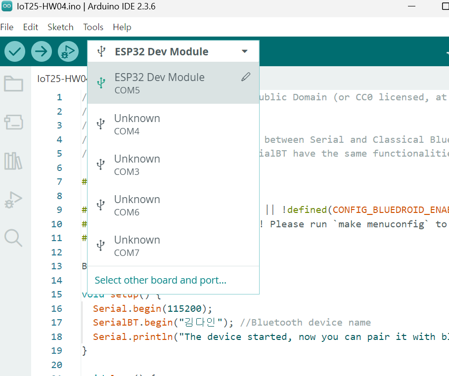

# IoT25-HW04

## Board and Port Screenshot

## Test Bluetooth Example
[Video](https://youtube.com/shorts/_RazB6UPDU0)

## Explain & Active Learning
The ESP32 is used as a Bluetooth serial device to enable text communication between a PC and a smartphone.

Description: Text entered in the PC's serial monitor is sent to the smartphone, and messages sent from the smartphone are displayed on the PC's serial monitor.

- BLE (Bluetooth Low Energy): A wireless communication technology designed to use low power, commonly used in IoT devices.
- UUID: A unique identifier for each BLE service and data characteristic.
- GATT (Generic Attribute Profile): A protocol that defines how BLE devices exchange data, consisting of a server (data provider) and a client (data requester).
- Profile: A set of services and data designed for a specific purpose.

